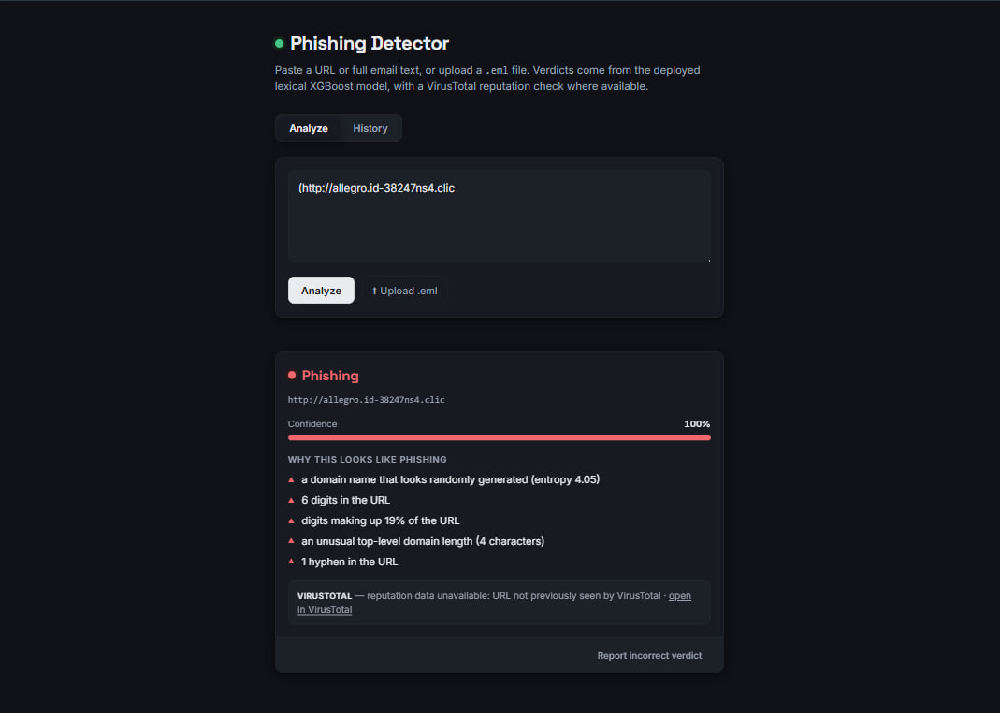
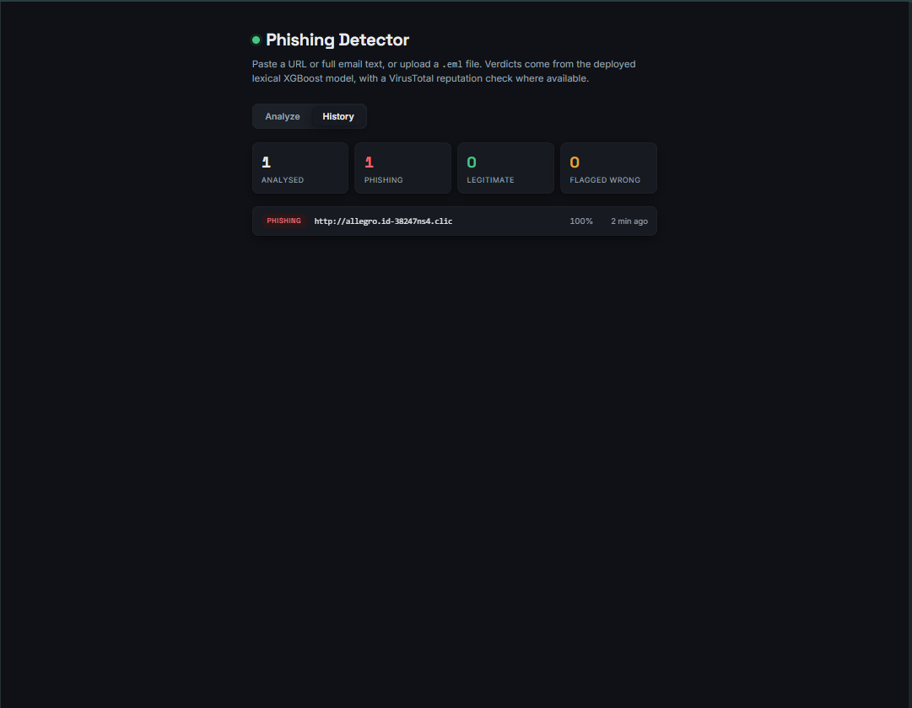

# Phishing Detector

A web app that checks whether a URL is a phishing attempt and explains why. Built with XGBoost + FastAPI for my final year dissertation on explainable ML in cybersecurity.



> **Live demo:** https://phishing-detector-nmyw.onrender.com/
> Password-protected, hosted on Render free tier so first load takes ~30-60s.

## What it does

Paste a URL or email, and it returns:
- A **verdict** (phishing or legitimate)
- A **confidence score**
- **Plain-English reasons** (e.g. "the domain looks randomly generated")
- **VirusTotal reputation** check

You can also report wrong verdicts, which override the model for that URL.

## How it works

```
Browser ──HTTP──> FastAPI app (src/api.py)
                   ├── password gate (optional)
                   ├── extract URLs from input
                   ├── XGBoost model → verdict + confidence
                   ├── TreeSHAP → plain-English reasons
                   └── human-correction override
                         │                    │
              VirusTotal API          SQLite (analyses,
              (optional)              feedback, corrections)
```

Single FastAPI process serves both API and frontend — no CORS, no separate frontend deploy.

## Performance

Tested on a domain-disjoint split (strict, no data leakage):

| Metric | Value |
|---|---|
| Accuracy | 72.1% |
| Recall | 41.8% |
| Precision | 78.2% |

The model misses about half of phishing URLs but when it flags something it's usually right. It's an explainable second opinion, not a production filter.

## Quickstart

Need Python 3.11+ and git.

### Windows
```powershell
git clone https://github.com/Sardorbeklondon/phishing-detector.git
cd phishing-detector
python -m venv .venv
.\.venv\Scripts\Activate.ps1
pip install -r requirements.txt
python -m uvicorn api:app --app-dir src --port 8000
```

### macOS / Linux
```bash
git clone https://github.com/Sardorbeklondon/phishing-detector.git
cd phishing-detector
python3 -m venv .venv
source .venv/bin/activate
pip install -r requirements.txt
python -m uvicorn api:app --app-dir src --port 8000
```

Then open http://localhost:8000.

## Usage

1. **Analyse a URL** — paste a URL and click Analyze
2. **Analyse an email** — paste email text or upload .eml file, links get extracted and checked
3. **History** — see recent analyses
4. **Report wrong verdict** — click "Report incorrect verdict" to override the model



## Environment Variables

All optional — app works without any of them.

| Variable | Purpose |
|---|---|
| `VIRUSTOTAL_API_KEY` | Enables VirusTotal reputation lookup |
| `GATE_PASSWORD` | Password-protects the whole app |
| `GATE_USERNAME` | Username for auth (default: admin) |
| `FEEDBACK_API_KEY` | Enables the correction endpoint |

## Running Tests

```bash
pip install -r requirements-dev.txt
# start server in one terminal:
PHISHING_DB_PATH=./test.db ANALYZE_RATE_LIMIT_PER_MIN=200 FEEDBACK_API_KEY=test-key \
  python -m uvicorn api:app --app-dir src --port 8000
# run tests in another:
pytest tests/
```

## Project Structure

```
src/           - API, feature extraction, model training, SHAP explanations
frontend/      - Single-page UI (no build step)
tests/         - Black-box and grey-box test suite
models/        - Pre-trained XGBoost model (committed, loaded at boot)
data/          - Raw datasets (~1.2GB, not in repo, only needed for retraining)
results/       - Experiment results and evaluation data
```

## Known Limitations

- Free tier cold starts take 30-60s
- Corrections/history wiped on restart (ephemeral storage)
- VirusTotal free API: 4 req/min limit
- Model has 41.8% recall — misses most phishing
- URL shorteners bypass the model (can't follow redirects)
- URL-only classifier, doesn't analyse email text content

## Deployment

See `DEPLOYMENT.md` for hosting setup (Render, Docker, env vars).

## Disclaimer

Research project for a university dissertation. Not a production security tool.
